# терминология НС

### Нейрон исскуственный 

%Существует несколько определений для искуственного нейрона.

**Нейрон** — это вычислительная единица, которая получает информацию, производит над ней простые вычисления и передает ее дальше. Они делятся на три основных типа:

1. входной (синий),
2. скрытый (красный)
3. выходной (зеленый).

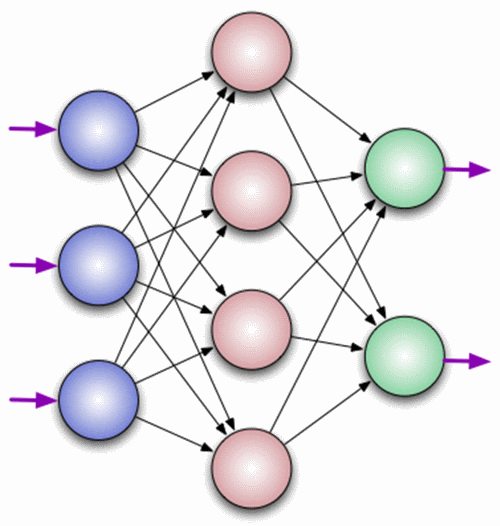

Также есть нейрон смещения и контекстный нейрон о которых мы поговорим в следующей статье.

**Нейрон** - это сумматор входных сигналов, который, затем, пропускает сумму через функцию активации (см. функцию активации нейрона )

Несмотря на большое разнообразие вариантов нейронных сетей, все они имеют общие черты. Так, все они, так же, как и мозг человека, состоят из большого числа связанных между собой однотипных элементов – _нейронов,_ см. нейрон, которые имитируют нейроны головного мозга. На рис. 1 показана схема нейрона.

Из рисунка видно, что искусственный нейрон, так же, как и живой, состоит из:

1. синапсов (см. синапс), связывающих входы нейрона с ядром;
2. ядра нейрона, которое осуществляет обработку входных сигналов
3. аксона (см. аксон), который связывает нейрон с нейронами следующего слоя.

Каждый синапс имеет вес, который определяет, насколько соответствующий вход нейрона влияет на его состояние. Состояние нейрона определяется по формуле

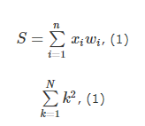

где

_n_ – число входов нейрона

_xi_ – значение i-го входа нейрона

_wi_ – вес i-го синапса.

Затем определяется _значение аксона нейрона_ по формуле

&#x20;                                                                   _**Y=f(S)**_, (2)

Где _f_ – некоторая функция, которая называется _активационной_. Наиболее часто в качестве активационной функции используется так называемый _сигмоид_, который имеет следующий вид:

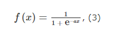

Основное достоинство этой функции в том, что она дифференцируема на всей оси абсцисс и имеет очень простую производную:

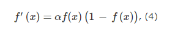

При уменьшении параметра a сигмоид становится более пологим, вырождаясь в горизонтальную линию на уровне 0,5 при a=0. При увеличении a сигмоид все больше приближается к функции единичного скачка.

Нейроны оперируют числами в диапазоне \[0,1] или \[-1,1]. А как же, вы спросите, тогда обрабатывать числа, которые выходят из данного диапазона? _На данном этапе, самый простой ответ — это разделить 1 на это число._ Этот процесс называется нормализацией (см. нормализация ), и он очень часто используется в нейронных сетях.

### Состав НЕЙРОНА 

% Нейрон состоит из:

1. входа;
2. входного сигнала;
3. [синапса](./#\_to6h5s36uiyx);
4. ядра, в котором происходит обработка входного сигнала;
5. линии связи между входом нейрона (фактически это выход нейрона предыдущего слоя) и ядром нейрона;
6. весовых коефициентов, весов входных сигналов, которые определяют, насколько соответствующий вход предыдущего нейрона влияет на состояние синапса;
7. матапарата нейрона (сумматора входных сигналов + функции активации)
8. [аксона](./#\_nrhp5otowvjt),
9. выхода нейрона

### Синапс 

%Синапсы – места соединения аксона одного нейрона с телом или отростком (дендритом или аксоном) другого нейрона. Через синапсы сигналы передаются от нейрона к нейрону.

### Аксон 

%

### Функция активации нейрона 

%_**Функции активации нейрона**_ - способ нормализации входных данных.

То есть, если на входе у вас будет большое число, пропустив его через функцию активации, вы получите выход в нужном вам диапазоне. Функций активации достаточно много поэтому мы рассмотрим самые основные: Линейная, Сигмоид (Логистическая) и Гиперболический тангенс.&#x20;

Главные их отличия — это диапазон значений.

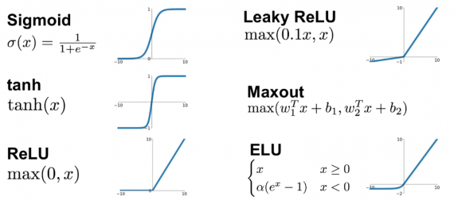

_**Функция активации** _ — определяет выходной сигнал, который определяется входным сигналом или набором входных сигналов.

_**Функция активации** _ — это один из самых мощных инструментов, который влияет на силу, приписываемую нейронным сетям. Отчасти, она определяет, какие нейроны будут активированы, другими словами и какая информация будет передаваться последующим слоям.

Существуют следующие _типы функций активации_

* линейная функция f(x) = x, см. линейная функция активации.
* ReLU, см. ReLU функция активации.
* Softmax , см. Softmax функция активации.
* Гиперболическая функции активации, см. Гиперболическая функция активациию
* Логистическая функция активации (сигмоид), см. Логистическая функция активации

### Перцептрон 

%кибернетическая модель мозга, простейшая [нейросеть](./#\_3f7444r4sniw). Она представляет собой упрощенное отражение работы биологической сети, состоящей из нейронов, соединенных между собой дендридами и аксонами:

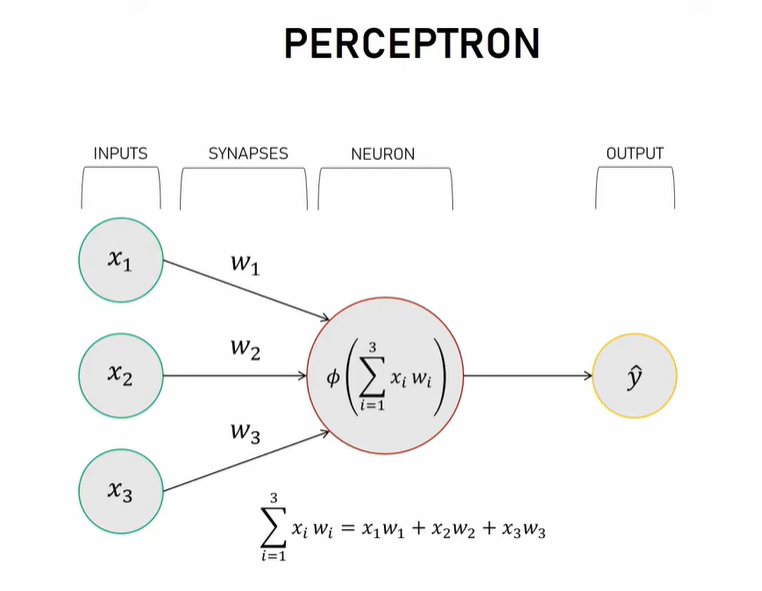

Историческая классификация

**Перцептрон с одним скрытым слоем**

Это классический [перцептрон](./#\_vauniolcso7c), которому посвящена бо́льшая часть книги Розенблатта, и рассматриваемый в данной статье: у него имеется по одному слою S-, A- и R-элементов.

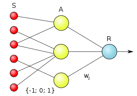

**Однослойный перцептрон**

Это модель, в которой входные элементы напрямую соединены с выходными с помощью системы весов. Является простейшей [сетью прямого распространения](https://ru.wikipedia.org/wiki/%D0%98%D1%81%D0%BA%D1%83%D1%81%D1%81%D1%82%D0%B2%D0%B5%D0%BD%D0%BD%D0%B0%D1%8F\_%D0%BD%D0%B5%D0%B9%D1%80%D0%BE%D0%BD%D0%BD%D0%B0%D1%8F\_%D1%81%D0%B5%D1%82%D1%8C#%D0%A1%D0%B5%D1%82%D0%B8\_%D0%BF%D1%80%D1%8F%D0%BC%D0%BE%D0%B3%D0%BE\_%D1%80%D0%B0%D1%81%D0%BF%D1%80%D0%BE%D1%81%D1%82%D1%80%D0%B0%D0%BD%D0%B5%D0%BD%D0%B8%D1%8F\_\(Feedforward\)) — [линейным классификатором](https://ru.wikipedia.org/wiki/%D0%9B%D0%B8%D0%BD%D0%B5%D0%B9%D0%BD%D1%8B%D0%B9\_%D0%BA%D0%BB%D0%B0%D1%81%D1%81%D0%B8%D1%84%D0%B8%D0%BA%D0%B0%D1%82%D0%BE%D1%80), и частным случаем классического перцептрона, в котором каждый S-элемент однозначно соответствует одному A-элементу, S—A связи имеют вес +1 и все A-элементы имеют порог θ = 1. Однослойные перцептроны фактически являются [формальными нейронами](https://ru.wikipedia.org/wiki/%D0%98%D1%81%D0%BA%D1%83%D1%81%D1%81%D1%82%D0%B2%D0%B5%D0%BD%D0%BD%D1%8B%D0%B9\_%D0%BD%D0%B5%D0%B9%D1%80%D0%BE%D0%BD), то есть пороговыми элементами Мак-Каллока — Питтса. Они имеют множество ограничений, в частности, они не могут идентифицировать ситуацию, когда на их входы поданы разные сигналы («задача XOR», см. [ниже](https://ru.wikipedia.org/wiki/%D0%9F%D0%B5%D1%80%D1%86%D0%B5%D0%BF%D1%82%D1%80%D0%BE%D0%BD#%D0%A4%D1%83%D0%BD%D0%BA%D1%86%D0%B8%D0%BE%D0%BD%D0%B0%D0%BB%D1%8C%D0%BD%D1%8B%D0%B5\_%D0%B7%D0%B0%D0%B1%D0%BB%D1%83%D0%B6%D0%B4%D0%B5%D0%BD%D0%B8%D1%8F)).

[**Многослойный перцептрон**](https://ru.wikipedia.org/wiki/%D0%9C%D0%BD%D0%BE%D0%B3%D0%BE%D1%81%D0%BB%D0%BE%D0%B9%D0%BD%D1%8B%D0%B9\_%D0%BF%D0%B5%D1%80%D1%86%D0%B5%D0%BF%D1%82%D1%80%D0%BE%D0%BD\_%D0%A0%D0%BE%D0%B7%D0%B5%D0%BD%D0%B1%D0%BB%D0%B0%D1%82%D1%82%D0%B0) **(по Розенблатту)**

Это перцептрон, в котором присутствуют дополнительные слои A-элементов. Его анализ провёл Розенблатт в третьей части своей книги.

[**Многослойный перцептрон**](https://ru.wikipedia.org/wiki/%D0%9C%D0%BD%D0%BE%D0%B3%D0%BE%D1%81%D0%BB%D0%BE%D0%B9%D0%BD%D1%8B%D0%B9\_%D0%BF%D0%B5%D1%80%D1%86%D0%B5%D0%BF%D1%82%D1%80%D0%BE%D0%BD\_%D0%A0%D1%83%D0%BC%D0%B5%D0%BB%D1%8C%D1%85%D0%B0%D1%80%D1%82%D0%B0) **(по Румельхарту)**

Это перцептрон, в котором присутствуют дополнительные слои A-элементов, причём, обучение такой сети проводится по методу [обратного распространения ошибки](https://ru.wikipedia.org/wiki/%D0%9C%D0%B5%D1%82%D0%BE%D0%B4\_%D0%BE%D0%B1%D1%80%D0%B0%D1%82%D0%BD%D0%BE%D0%B3%D0%BE\_%D1%80%D0%B0%D1%81%D0%BF%D1%80%D0%BE%D1%81%D1%82%D1%80%D0%B0%D0%BD%D0%B5%D0%BD%D0%B8%D1%8F\_%D0%BE%D1%88%D0%B8%D0%B1%D0%BA%D0%B8), и обучаемыми являются все слои перцептрона (в том числе S—A). Является частным случаем многослойного перцептрона Розенблатта.

В настоящее время в литературе под термином «перцептрон» понимается чаще всего однослойный перцептрон ([англ.](https://ru.wikipedia.org/wiki/%D0%90%D0%BD%D0%B3%D0%BB%D0%B8%D0%B9%D1%81%D0%BA%D0%B8%D0%B9\_%D1%8F%D0%B7%D1%8B%D0%BA) _Single-layer perceptron_), причём, существует распространённое заблуждение, что именно этот простейший тип моделей предложил Розенблатт. В противоположность однослойному ставят «многослойный перцептрон» ([англ.](https://ru.wikipedia.org/wiki/%D0%90%D0%BD%D0%B3%D0%BB%D0%B8%D0%B9%D1%81%D0%BA%D0%B8%D0%B9\_%D1%8F%D0%B7%D1%8B%D0%BA) _Multilayer perceptron_), опять же, чаще всего подразумевая многослойный перцептрон Румельхарта, а не Розенблатта. Классический перцептрон в такой дихотомии относят к многослойным.

### Нейронная сеть исскуственная 

%Сущесвтует несколько поределений нейронной сети.

**Нейросеть** - это связка нейронов.

* Каждый из этих нейронов получает данные, обрабатывает их, а потом передаёт другому нейрону.

**Нейросеть** - попытка с помощью математических моделей воспроизвести работу человеческого мозга для создания машин, обладающих искусственным интеллектом.

_Условия для нейросетей:_

1. Во время инициализации нейронной сети, _веса расставляются в случайном порядке_.

Нейронная сеть которая обычно обучается с учителем. Это означает наличие обучающего набора (датасета), который содержит примеры с истинными значениями: тегами, классами, показателями.

### Состав нейросети 

[НЕЙРОСЕТЬ ](./#\_3f7444r4sniw)состоит из:

1. слоев нейронов:
   1. входной,
   2. скрытый,
   3. выходной слои;
2. вектора входных сигналов;
3. синапсов, линий связи между слоями нейронов;
4. весовых коэффициентов между выходами одного слоя (1го) и входами другого, следующего слоя нейронов;
   1. Во время инициализации нейронной сети, веса расставляются в случайном порядке.!!!

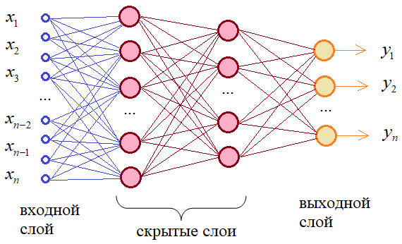

### Параметры нейронной сети 

%параметры нейронных сетей определяються в зависимости от типа сети.

Для искуственных нейронных сетей которые описывыают аналитическую модель нейросети используют различные параметры.

Для моделей нейросетей, реализованых посредством использоваия прикладного пакета Keras, сущуствуют следующие параметры:

* input\_dim, см. input\_dim параметр
* Dense, см Dense слой
* слои, в Keras могут быть следующих типов
  * Dense, см.Dense слой
  * Embedding, см. Embedding слой
    * Embedding метод имеет следующие параметры

_**keras.layer.Embedding(input\_dim, outpu\_dim,..., input\_lenght)**_

* _input\_dim_, число слов в словаре;
* _outpu\_dim_, число входов в полоносвязном Embedding слое
* _input\_lenght_, размер входного вектора (число слов _inp\_words_, по которому стороится прогноз
* SimpleRnn, см.SimpleRnn слой
* Conv2D, см.Conv2D слой
* MaxPooling2D, см.MaxPooling2D слой
* Flatten, см. Flatten слой

### Типы нейросетей 

%сети различают по количества слоёв, они могут быть

* _**однослойные**_, см. [однослойные сети](./#\_rfkh5onl7azl)
* _**многослойные**_, см. [многослойные сети](./#\_7pmycjypmm8f)
* _**полносвязными**_, они в свою очередь деляться на
  * сети _**прямого распространения**_ или однонаправленные, см. сети прямого распространения
  * _**рекуррентные**_ (с обратными связями), см. [рекуретные сети](./#\_qjnuohpmp894)

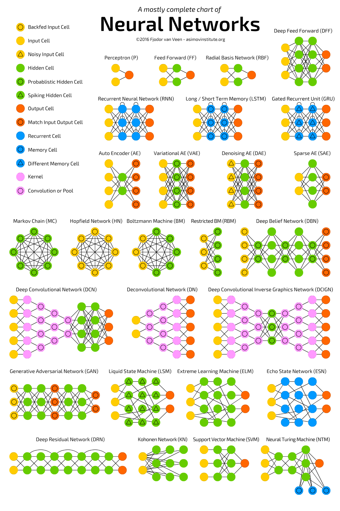

[https://www.asimovinstitute.org/](https://www.asimovinstitute.org/)

### Однослойные сети 

%

### Многослойные сети 

%

### Сети прямого распространения 

%

### Рекуретные сети 

%

### Нейронных сетей применение 

%Самыми распространенными применениями нейронных сетей является:

1. Классификация, см. [Классификация нейронными сетями](./#\_vd4w01qozjkt).
2. Предсказание, см. [Предсказание нейронными сетями](./#\_uuen7hxb7vrv)
3. Распознавание, см. [Распознавание нейронными сетями](./#\_uuen7hxb7vrv)

### Классификация нейронными сетями 

%Задача распределение данных по параметрам. Например, на вход дается набор людей и нужно решить, кому из них давать кредит, а кому нет. Эту работу может сделать нейронная сеть, анализируя такую информацию как: возраст, платежеспособность, кредитная история и тд.

### Предсказание нейронными сетями 

%Предсказание — возможность предсказывать следующий шаг. Например, рост или падение акций, основываясь на ситуации на фондовом рынке.

### Распознавание нейронными сетями 

%Распознавание — в настоящее время, самое широкое применение нейронных сетей. Используется в Google, когда вы ищете фото или в камерах телефонов, когда оно определяет положение вашего лица и выделяет его и многое другое.

### Dense слой 

%полносвязный слой, парасмтер в Keras описывается, как

_**model.add(Dense(num\_characters, activation=’activation\_funcaiton\_type’,**_

он может принимать следующи параметры:

* _**num\_characters**_ - количество нейронов в слое
* _**activation=’activation\_funcaiton\_type’**_ - где ’activation\_funcaiton\_type’, тип выбраной функции активации

### Embedding слой 

%

_**keras.layer.Embedding(input\_dim, outpu\_dim,..., input\_lenght)**_

* _input\_dim_, число слов в словаре;
* _outpu\_dim_, число входов в полоносвязном Embedding слое
* _input\_lenght_, размер входного вектора (число слов _inp\_words_, по которому стороится прогноз

### &#x20;

### Conv2D слой 

%

### SimpleRnn слой 

%

### MaxPooling2D слой 

%

### Flatten слой 

%

### input\_dim параметр 

%параметр нейронной сети, указывающий, какое количество значений будет подаваться на вход заданного слоя нейронной сети.

### Dense параметр 

% обозначение полносвязного слоя в нейронной сети.

### fit, метод Kerasа 

%метод Keras, запускающий обучение нейронной сети.

### CNTK 

%_**Cognitive Toolkit(Microsoft)**_ — стандартизированный инструментарий для проектирования и развития сетей разнообразных видов, применяет искусственный интеллект для работы с большими объёмами данных путем глубокого обучения. Имеет архитектуру, совместимую с популярными языками и сетями, такими как, C++ и Python.

### CUDA 

%изначально аббр. от англ. Compute Unified Device Architecture — программно-аппаратная архитектура параллельных вычислений, которая позволяет существенно увеличить вычислительную производительность благодаря использованию графических процессоров фирмы Nvidia.

### cuDNN 

%библиотека, содержащая оптимизированные для GPU реализации сверточных и рекуррентных сетей, различных функций активации, алгоритма обратного распространения ошибки и т.п., что позволяет обучать нейронные сети на GPU в несколько раз быстрее, чем просто CUDA.

### Data Mining 

%собирательное название, используемое для обозначения совокупности методов интеллектуального анализа данных.

### Epoch(Эпоха) 

%Эпоха - количество повторений циклов обучения для всей выборки данных.

### Back propagation (алгоритм) 

%см [**Алгоритм обратного распространения ошибки**](./#\_fyodaxo2760l), который, в свою очередь, базируется на алгоритме [**градиентного спуска**](./#\_e9j6n6sl13e7).

### Градиентного спуска алгоритм 

%

### Обратного распространения ошибки алгоритм 

%(Back Propagation) - модификация метода классического градиентного спуска, метод обновления весов нейронной сети, при котором распространение сигналов ошибки происходит от выходов сети к её входам, в направлении, обратном прямому распространению сигналов в обычном режиме работы.

### Архитектура сверточной НС 

%включает в себя:

* фильтр(ы) (kernel / filter /feature),
* слой(и) фильтров,
* сверточный слой, слой фильтра. Он базовый,
* размера фильтра,
* stride - шага, с которым “окно” фильтра ходит по “большой” матрице
* канал(ов) - для анализа монохромных или цветных изображений
* pooling слоя - изменение масштабирования, слой(матрица) который расситывается из значений “фильтра”.\
  Может быть min, max, average.
  * Keras содержит следующие методы
    * MaxPooling
    * MinPooling
    * AvaragePooling

\

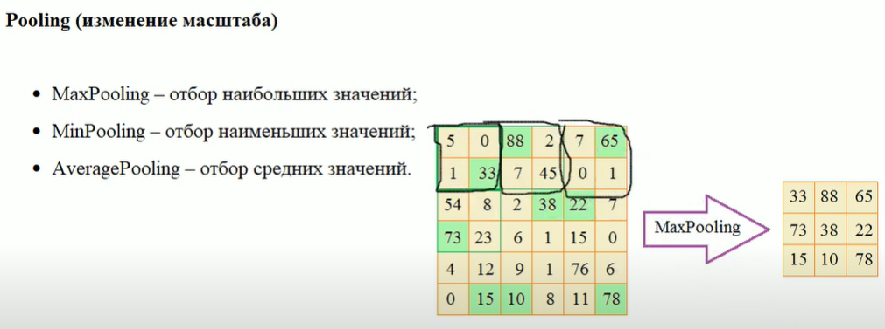

* свойство универсального аппроксиматора. В рекуррентных и полносвязных сетях бал правят такие нелинейности, как сигмоида и гиперболический тангенс.
* ReLU — Rectified Linear Unit. По-русски ReLU принято называть линейным фильтром. Это простейшая нелинейная функция, к тому же не гладкая. Но зато она вычисляется за одну элементарную операцию, за что ее очень любят разработчики вычислительных фреймворков.

### Вектор наблюдений 

%

Шаг обучения НС

%

Обучение НС

%процесс вычисление(подбора) локальных градиентов, весовых коэфициентов выходных нейронов

Переобучение

%

### Весовые коэффициенты нейронов 

%синаптический вес

### Локальные градиенты 

%

### Критерий качества обучения НС 

%Рекомендации:

№ 1 - запускать алгоритм для разных значений весовых коефициентов. И, затем, отобрать лучший вариант. Начальные значения генерируем случайным образом в окрестности нуля, кроме тех что относяться к bias’ам.

№ 2

№ 3

№ 4

№ 5

№ 6 - Использовать минимально необходимое число нейронов в НС

Решение медленной сходимости градиентных алгоритмов оптимизации на пологих участках активационных функций

### Методы оптимизации алгоритмов сходимости 

%

* оптимизация на основе моментов (momentum)
* ускоренные градиенты Нестерова (nesterov momentum)
* метода Adagrad
* метод RMSProp
* метод Adadelta
* метод Adam, см. Adam алгоритм оптимизации
* метод NAdam

### Adam алгоритм оптимизации 

%Adam - adaptive moment estimation, оптимизационный алгоритм, используемый для обучения сети, основная функция которого - изменение весов сети для уменьшения ошибки сети в процессе обучения. Для каждого нейрона алгоритм изменяет веса индивидуально.

### Обучающее множество 

%

### Нормализация входных данных 

%

### Линейная функция активации 

%линейная функция f(x) = x. Является наиболее простой из всех функций активации, должна применяться лишь для тестирования созданной нейросети либо передачи данных в исходной форме.

### Гиперболическая функции активации (нейрона) 

% Метод нужен для охвата также и отрицательных значений. Когда их применение не предусмотрено, гиперболический тангенс не нужен.

— гиперболический тангенс.

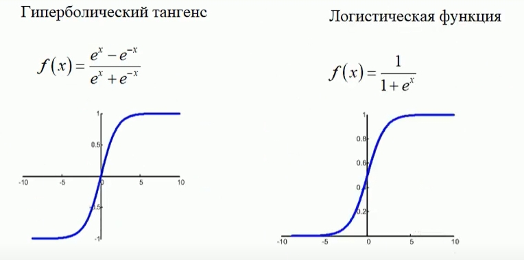

### Логистическая функции активации 

%Диапазон значений — от нуля до единицы. Также её называю логистической функцией;

### 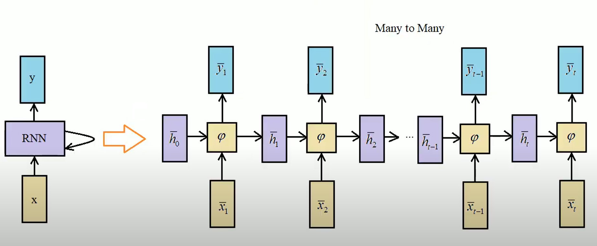 

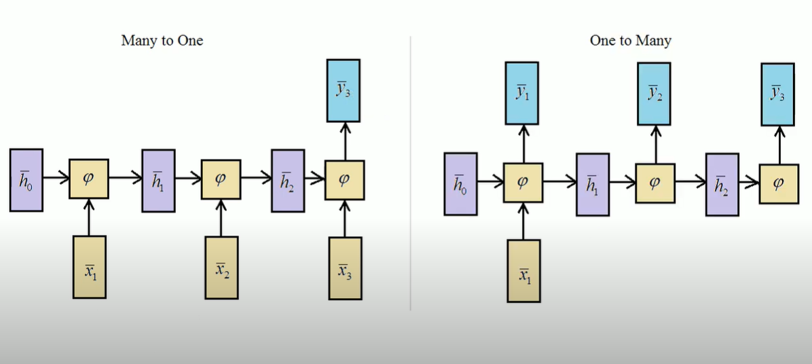

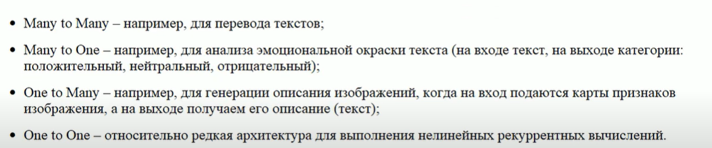

### Шаг сходимости алгоритма обучения 

%

### argmax 

%метод библиотеки NumPy, возвращающий индекс максимального значения в массиве.

### Сеть прямого распространения (Feedforward) 

%это сеть, в которой все связи направлены строго от входных нейронов к выходным.

### ReLU функция активации 

%активационная функции выполняющая простое нелинейное преобразование поданных на вход данных (x). Возвращает x, если x >0 и 0 в противном случае. Отличается высокой скоростью вычисления.

### Sequential модель 

%модель в библиотеке Keras, позволяющая создать нейронную сеть прямого распространения путем последовательного добавления слоев.

### Softmax функция активации 

%активационная функция, выполняющая нелинейное преобразование на основе математической функции: взвешенная сигмоида. Также может быть использована как функция активации для выходного слоя в задачах многоклассовой классификации. Преобразует значения в вектор вероятностей.

### One hot encoding 

%метод преобразования категориальных данных при котором каждая категория кодируется 1 или 0, в зависимости от присутствия данной категории в конкретном примере данных. (Например для 5 категорий отсутствие всех категорий будет выглядеть как (0,0,0,0,0), присутствие только первой категории (1,0,0,0,0) и т.д.)

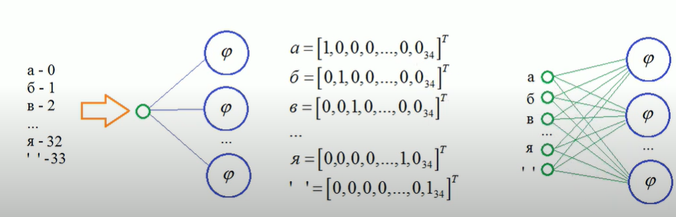

### optimizer (функция оптимизатора) 

%оптимизационный алгоритм (функция), задача которого - изменение весов сети для уменьшения ошибки сети в процессе обучения.

### predict метод 

%метод Keras, запускающий работу нейронной сети на предсказание / распознавание данных.

### PyTorch 

%библиотека машинного обучения для языка Python с открытым исходным кодом, созданная на базе Torch. Используется для обработки естественного языка. Разрабатывается преимущественно группой искусственного интеллекта Facebook.

### MNIST 

%сокращение от «Modified National Institute of Standards and Technology», — объемная база данных образцов рукописного написания цифр. База данных является стандартом, предложенным Национальным институтом стандартов и технологий США с целью калибрации и сопоставления методов распознавания изображений с помощью машинного обучения в первую очередь на основе нейронных сетей.

### Loss функция ошибки 

%функция потерь нейронной сети – математическая дифференцируемая функция, характеризующая разницу между «истинным» значением целевой переменной и предсказанным нейронной сетью значением. В Keras - название параметра, передаваемого в метод compile при компиляции сети.

### Нейросетей базовая математика 

%Базовая математика для исскуственных нейронных сетей включает в себя следующие задачи:

1. Решение поэлементных операции
2. Умножение матриц
   1. Дискретная математика,
   2. Алгебра линейных уравнений,
   3. Алгебра диференциальных уравнений
3. Определение размер матриц
4. Частные производные деривативы
5. Решение полных деривативов
   1. Пример решений задач здесь >> [Symbolab](https://www.symbolab.com/solver/partial-derivative-calculator) - [Partial Derivative Calculator](https://www.symbolab.com/solver/partial-derivative-calculator)

Области которые охватывают нейросети затрагивают разделы:

1. Теории вероятности и Математической статистика

.png>)

2\. Линейной алгебры или Алгебры линейных уравнений

.png>)

3\. Математического анализа

 (1) (1).png>)

3\. Дискретной математика,

4\. Алгебры диференциальных уравнений,

Краткий обзор "базовой математики" доступен здесь:&#x20;

1. &#x20;[Базовая математика для нейронных сетей - YouTube](https://www.youtube.com/watch?v=Ny3LRl23dsM)
2. [Математика Для Машинного Обучения - YouTube](https://www.youtube.com/watch?v=CS7aRo2REfE)
3. [А. Шень Вероятность: примеры и задачи Издание четвёртое, стереотипное. Москва Издательство МЦНМО 2016](https://www.mccme.ru/free-books/shen/shen-probability.pdf)

### Базовые математические понятия 

К базовым математическим операциям в контектсе проектирования нейросетей можно отнести следующие термины

* средневзвешенное значение

### Средневзвешенное значение

%— общее название группы разновидностей среднего значения либо короткое название для любого из перечисленных:

Среднее арифметическое взвешенное&#x20;

Среднее геометрическое взвешенное&#x20;

Среднее гармоническое взвешенное&#x20;

Среднее степенное взвешенное

### Среднее арифметическое взвешенное&#x20;

%— равна отношению (суммы произведений значения признака к частоте повторения данного признака) к (сумме частот всех признаков).Используется, когда варианты исследуемой совокупности встречаются неодинаковое количество раз.

_Пример 2_. Найти среднюю заработную плату рабочих цеха за месяц

<figure><figcaption></figcaption></figure>

Средняя заработная плата может быть получена путем деления общей суммы заработной платы на общее число рабочих:

Ответ: 3,35 тыс.руб.

### Среднее геометрическое взвешенное&#x20;

набора [вещественных чисел](https://math.fandom.com/ru/wiki/%D0%92%D0%B5%D1%89%D0%B5%D1%81%D1%82%D0%B2%D0%B5%D0%BD%D0%BD%D0%BE%D0%B5\_%D1%87%D0%B8%D1%81%D0%BB%D0%BE)  с вещественными весами  определяется как

&#x20;                &#x20;

<figure><figcaption></figcaption></figure>

В том случае, если все веса равны между собой, среднее геометрическое взвешенное равно среднему геометрическому.

Существуют также взвешенные версии для других средних величин. Наиболее известным является среднее взвешенное арифметическое, обычно называемое просто [среднее взвешенное](https://math.fandom.com/ru/wiki/%D0%A1%D1%80%D0%B5%D0%B4%D0%BD%D0%B5%D0%B5\_%D0%B2%D0%B7%D0%B2%D0%B5%D1%88%D0%B5%D0%BD%D0%BD%D0%BE%D0%B5).

### Среднее гармоническое взвешенное&#x20;

набора [вещественных чисел](https://math.fandom.com/ru/wiki/%D0%92%D0%B5%D1%89%D0%B5%D1%81%D1%82%D0%B2%D0%B5%D0%BD%D0%BD%D0%BE%D0%B5\_%D1%87%D0%B8%D1%81%D0%BB%D0%BE)  с вещественными весами  определяется как

<figure><figcaption></figcaption></figure>

В том случае, если все веса равны между собой, среднее гармоническое взвешенное равно среднему гармоническому.

Существуют также взвешенные версии для других средних величин. Наиболее известным является среднее взвешенное арифметическое, обычно называемое просто [среднее взвешенное](https://math.fandom.com/ru/wiki/%D0%A1%D1%80%D0%B5%D0%B4%D0%BD%D0%B5%D0%B5\_%D0%B2%D0%B7%D0%B2%D0%B5%D1%88%D0%B5%D0%BD%D0%BD%D0%BE%D0%B5).

### Среднее степенное взвешенное
