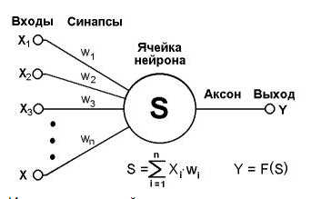

# Q\&A

1.  \
    В. Чем аксон отличается от выхода нейрона?\
    О. Ничем. Аксон и есть выход нейрона. \

    <figure><figcaption></figcaption></figure>
2. В: Какая грануляция величины весовых коефициентов НС?\
   О: Весовые коефициенты выбираються исходя из нормированных значений входных сигналов.&#x20;
